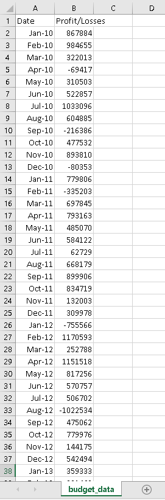
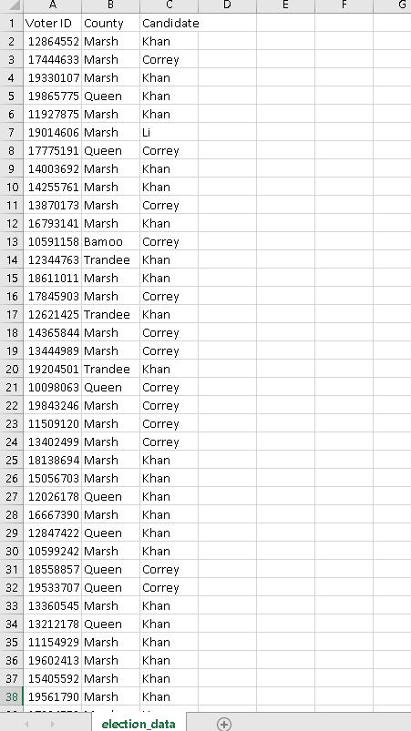
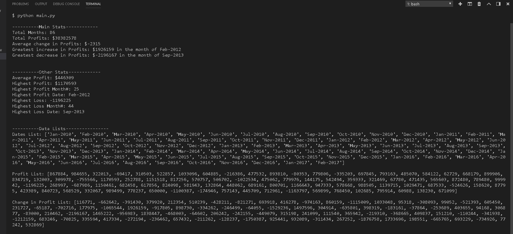
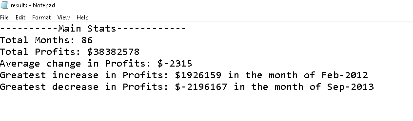
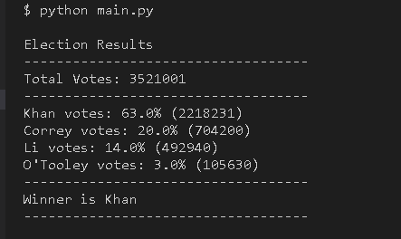
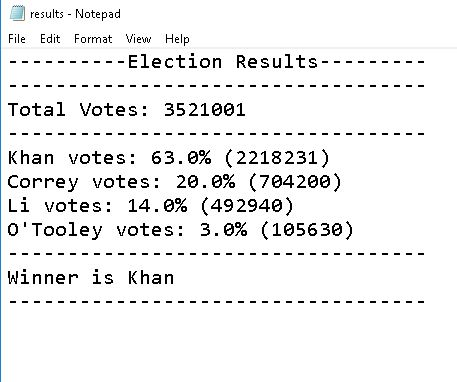

# Python-Challenge
## Using Python scripting skills to complete `PyBank` and `PyPoll` challenges.  To analyze data in csv files and output results in the terminal as well as a text file.
- - -

## Folder Structure

### A typical top-level directory layout

    . Python-Challenge
    ├── PyBank	    # PyBank Analysis
    |   ├── output	    # Contains results.txt file
    |   ├── Resources   # Contains raw data file budget_data.csv
    |   └── main.py     # python scripting file generates results.txt
    |
    ├── PyPoll	    # PyPoll Analysis
    |   ├── output	    # Contains results.txt file
    |   ├── Resources   # Contains raw data file election_data.csv
    |   └── main.py     # python scripting file generates results.txt
    |
    ├── README.md
    └── image
        └── png files	  # image files for README.md

## Raw Data
We are given 2 CSV files with raw data to work with.  The `PyBank` challenge has a raw data file called `budget_data.csv`.  The CSV file is stored in the `Resources` folder.  The CSV file contains 86 rows of data containing 1 header row with 2 columns: Date and Profit/Loss.

### PyBank Data

The `PyPoll` challenge has a raw data file called `election_data.csv`.  The CSV file is stored in the `Resources` folder.  The CSV file contains **`3.5 million rows`** of data containing 1 header row with 3 columns: Voter ID (unique), County and Candidate.

### PyPoll Data

## Results

### Terminal Output for PyBank Analysis

### Text File Output for PyBank Analysis

### Terminal Output for PyPoll Analysis

### Text File Output for PyPoll Analysis

- - -

### Copyright

Kean Amaral © 2018. All Rights Reserved.
